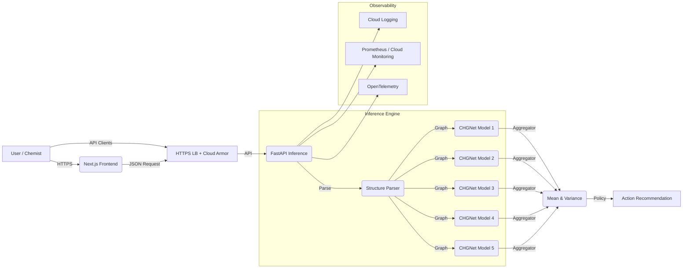

# CathodeScreen: High-Throughput Screening of Li-Ion Battery Cathodes


**CathodeScreen** is an enterprise-grade machine learning framework designed to accelerate the discovery of thermodynamically stable lithium-ion battery cathode materials. It implements a scalable inference pipeline utilizing a deep ensemble of **CHGNet** (Crystal Hamiltonian Graph Neural Network) models to robustly predict energy above hull ($E_{hull}$) with quantified epistemic uncertainty.


## Table of Contents
1.  [Abstract](#-abstract)
2.  [Problem Statement](#-problem-statement)
3.  [System Architecture](#-system-architecture)
4.  [Machine Learning Pipeline](#-machine-learning-pipeline)
    *   [Dataset & Splitting](#dataset--splitting)
    *   [Model Architecture](#model-architecture-cgcnn)
    *   [Uncertainty Quantification](#uncertainty-quantification)
5.  [Performance Metrics](#-performance-metrics)
6.  [Installation & Deployment](#-installation--deployment)
7.  [Citation](#-citation)

---

## Abstract

The discovery of novel cathode materials is constrained by the computationally expensive nature of Density Functional Theory (DFT) calculations, which scale as $O(N^3)$. **CathodeScreen** implements a data-driven screening funnel that serves as a pre-filter for DFT. By leveraging CHGNet trained on merged Li-cathode datasets (MP + OQMD + MP2024), the system identifies thermodynamically stable candidates ($E_{hull} < 0.05$ eV/atom) with a **26.29x enrichment** at the top 1% on MP test data, and retains positive enrichment on OOD datasets (OQMD: **1.36x**, JARVIS: **1.86x**).

## Problem Statement

Traditional high-throughput screening relies on massive DFT compute resources. However:
1.  **Cost**: A single relaxation can take hundreds of CPU hours.
2.  **Efficiency**: Most candidate materials are unstable ($E_{hull} > 0.1$ eV/atom) and are discarded after expensive computation.
3.  **Trust**: Single-point ML predictions fail on Out-of-Distribution (OOD) data (e.g., novel crystal polymorphs).

**Solution**: A deep ensemble that not only predicts stability but estimates its own *competence* (uncertainty) to flag OOD materials for "Active Learning" or manual review.

---

## System Architecture

The application uses a decoupled microservices architecture optimized for cloud deployment. In production, the API can be fronted by an HTTPS load balancer with Cloud Armor (optional, requires a custom domain) and connected to centralized logging/metrics/tracing for SRE.



### Components
*   **Inference Engine (Backend)**: Built with **FastAPI** and **PyTorch**. Validates crystal structures via `pymatgen`, generates graph embeddings, and executes vectorized inference on CPU (< 50ms latency).
*   **User Interface (Frontend)**: built with **Next.js 14** (App Router). Features server-side rendering (SSR) for SEO and a responsive UI tailored for researchers.
*   **Orchestration**: Fully containerized with highly optimized Docker images (multi-stage builds to minimize size).

---

## Machine Learning Pipeline

### Dataset & Splitting
*   **Source**: The Materials Project (2025 Database).
*   **Scope**: 17,227 Transition Metal Oxides (TMOs).
*   **Validation Strategy**: **SOAP-LOCO** (Smooth Overlap of Atomic Positions - Leave One Cluster Out).
    *   Instead of random splitting, we cluster materials by structural similarity (using SOAP descriptors).
    *   We train on $N-1$ clusters and test on the unseen cluster. This mimics the real-world scenario of discovering *new* families of materials, ensuring our metrics are rigorous.

### Model Architecture: CHGNet
We utilize **CHGNet** (Crystal Hamiltonian Graph Neural Network, Deng et al., 2023) — a universal neural network potential pre-trained on the Materials Project.
*   **Base Model**: CHGNet v0.3.0 with 412,525 parameters
*   **Fine-tuning**: Trained on Li-O-TM cathodes with SOAP-LOCO splits
*   **Ensemble**: 5 models with different random seeds for uncertainty
*   **Output**: Direct E_hull prediction (not total energy)

### Uncertainty Quantification
We implement **Deep Ensembles** (Lakshminarayanan et al., 2017) to quantify **Epistemic Uncertainty** (model ignorance).
*   We train **M=5** models with different random initializations and data shuffles.
*   **Prediction**: μ = (1/M) Σ μ<sub>m</sub>(x)
*   **Uncertainty**: σ² = (1/M) Σ (μ<sub>m</sub>(x)² − μ²)

### Decision Policy
Materials are classified based on a hybrid policy:

| Action | Criterion | Meaning |
| :--- | :--- | :--- |
| **KEEP** | μ < 0.05 eV & σ < 0.02 | High confidence stable. Send to DFT. |
| **MAYBE** | 0.05 ≤ μ ≤ 0.15 or σ > 0.02 | Uncertain. Manual review recommended. |
| **KILL** | μ > 0.15 eV | Confident unstable. Do not compute. |

---

## Performance Metrics (v2-merged)

> **Summary (MP test, E_hull <= 0.05)**: EF@1% = **26.29x**, Recall@100 = **55.7%**, Precision@100 = **10.1%**, Top-1% hit rate = **50.0%**.

### Grounded Win (MP test set)

| Metric | Value |
| :--- | :--- |
| **EF@1%** | **26.29x [8.10, 46.80]** |
| **AUPRC** | 0.273 |
| **Recall@100** | 55.7% [30.8%, 78.9%] |
| **Precision@100** | 10.1% [4.0%, 16.0%] |
| **Top-1% Hit Rate** | 50.0% |
| **Dataset Prevalence** | 1.7% |

### OOD Validation (E_hull <= 0.05)

| Dataset | EF@1% | Precision@100 | Top-1% Hit Rate | Prevalence |
| :--- | :--- | :--- | :--- | :--- |
| **OQMD** | **1.36x [0.57, 2.27]** | **67.8% [58.0%, 77.0%]** | 31.8% | 23.0% |
| **JARVIS** | **1.86x [1.52, 2.18]** | **78.0% [70.0%, 86.0%]** | 79.4% | 43.2% |

**Model Scope**: Li-containing oxide cathode materials (Li-O-TM)  
**Validation**: MP SOAP-LOCO splits for in-domain; OQMD + JARVIS for OOD

---

## H100 Training Runs (Vertex AI)

Recent CHGNet training and evaluation jobs on H100 (Vertex AI custom jobs):

| Job Name | Duration |
| :--- | :--- |
| chgnet-h100-ensemble-oqmd-v1 | 4h 46m |
| chgnet-ehull-h100-oqmd-v1 | 53m 15s |
| chgnet-ehull-h100-ens-v1 | 3h 15m |
| chgnet-ehull-h100-v1 | 40m 12s |
| chgnet-training-h100-v1 | 11h 43m |

These runs provide the H100 training baseline referenced by the grounded-win reports in `reports/`.

Job config summary (from `gcp/custom_job_ehull_h100*.yaml` and `scripts/40_train_gcp_h100.py` defaults):

- chgnet-ehull-h100-v1 / chgnet-ehull-h100-oqmd-v1: `scripts/21_finetune_chgnet_v3.py`; epochs 60; batch 128; lr 1e-3; data `/app/data/processed/merged_dataset`; output `/app/checkpoints/gcp_h100/ehull_oqmd_v1`.
- chgnet-ehull-h100-ens-v1 / chgnet-h100-ensemble-oqmd-v1: `scripts/24_train_chgnet_ensemble.py`; epochs 60; batch 128; lr 1e-3; output `/app/checkpoints/gcp_h100/ehull_oqmd_ens_v1`.
- chgnet-ehull-h100-ens-v1 (eval): `scripts/42_run_grounded_win.py`; batch 64; `CATHODE_DEVICE=cuda`; `CATHODE_CALIBRATOR_MODE=mu`.
- chgnet-training-h100-v1: `scripts/40_train_gcp_h100.py`; pretrain 30 / finetune 60; batch 256; lr 1.5e-3; 7-model ensemble; bf16; warmup 3.

---

## Installation & Deployment

### Option 1: Docker (Recommended)
The system is ready for cloud deployment (e.g., Google Cloud Run, AWS Fargate).

```bash
# 1. Start the stack
docker-compose up --build -d

# 2. Access
# Frontend: http://localhost:3000
# Backend Docs: http://localhost:8080/docs
```

Optional edge proxy (rate limiting, headers):

```bash
docker-compose -f docker-compose.yml -f docker-compose.edge.yml up --build -d
```

GCP deployment notes are in `docs/gcp_deployment.md` (uses `deploy_gcp.ps1`).
GCP edge, observability, and scaling guides: `docs/gcp_edge_cloud_armor.md`, `docs/gcp_observability.md`, `docs/gcp_scaling.md`.

### Option 2: Local Development

**Prerequisites**: Python 3.10+, Node.js 20+

```bash
# Backend (Terminal 1)
# Must run from project root
pip install -r web/api/requirements.txt
python -m uvicorn web.api.main:app --port 8001

# Frontend (Terminal 2)
# Must navigate to frontend directory first!
cd web/frontend
npm install
npm run dev
```

### API Security & Limits

For production deployments:
- Set `CATHODE_ENV=production`, `CATHODE_AUTH_ENABLED=true`, and provide `CATHODE_API_KEY` (or `CATHODE_API_KEYS` / `CATHODE_API_KEY_HASHES`). Requests can use `X-API-Key` or `Authorization: Bearer`.
- Configure request limits and validation, e.g. `CATHODE_RATE_LIMIT_PER_MINUTE`, `CATHODE_MAX_FILE_BYTES`, `CATHODE_MAX_BATCH_SIZE`, and `CATHODE_MAX_ATOMS`.
- Apply backpressure with `CATHODE_MAX_CONCURRENT_REQUESTS` and `CATHODE_CONCURRENCY_TIMEOUT_SECONDS`.
- Consider `CATHODE_IP_ALLOWLIST`, `CATHODE_TRUST_PROXY`, `CATHODE_FORCE_HTTPS`, and `CATHODE_SECURITY_HEADERS` behind a trusted reverse proxy.
- Use `CATHODE_SECRET_FILE` or `CATHODE_SECRET_COMMAND` to load secrets at startup.
- Enforce startup checks with `CATHODE_STRICT_STARTUP=true` and `CATHODE_REQUIRE_CALIBRATION=true`.
- Sign and verify artifacts with `CATHODE_MANIFEST_HMAC_KEY` + `CATHODE_REQUIRE_MANIFEST_SIGNATURE=true`.
- Keep safe checkpoint loading enabled; only set `CATHODE_ALLOW_UNSAFE_TORCH_LOAD=true` when artifacts are fully trusted.

### Observability

- Each response includes `X-Request-ID` (client-supplied or generated).
- Enable request logging with `CATHODE_LOG_REQUESTS=true`.
- Enable Prometheus text metrics at `/metrics/prometheus` with `CATHODE_PROMETHEUS_ENABLED=true`.
- Enable OpenTelemetry tracing with `CATHODE_OTEL_ENABLED=true` and set `CATHODE_OTEL_EXPORTER_OTLP_ENDPOINT`.
- See `docs/observability.md` for example alert rules.
- GCP-specific alert setup is covered in `docs/gcp_observability.md`.

### ML Governance

- Generate and sign artifact manifests with `scripts/08_generate_artifact_manifest.py --sign` and verify via `CATHODE_REQUIRE_MANIFEST_SIGNATURE=true`.
- Evaluate prediction quality with `scripts/09_evaluate_predictions.py`.
- Track drift with `scripts/10_compute_drift.py` (outputs `retrain_recommended` when PSI exceeds threshold).
- Gate releases with `scripts/12_validate_release.py` and publish to a registry using `scripts/13_publish_registry.py`.

See `docs/production_checklist.md` for a full production readiness checklist.

### Load Testing

- Use `scripts/11_load_test_api.py` to generate baseline latency/error stats for `/predict`.
- For Cloud Run scaling guidance, see `docs/gcp_scaling.md`.

### DFT Spot Check (Quantum Espresso)

A small DFT audit batch is generated under `reports/dft_qe_jarvis_50_mix` to validate screening results with QE relaxations.

```bash
cd reports/dft_qe_jarvis_50_mix
python3 check_pseudos.py

# Sequential
PW_CMD=pw.x bash run_all_qe.sh

# Parallel on a single VM
JOBS=4 MPI_PROCS=2 PW_CMD=pw.x bash run_all_qe_parallel.sh

# Slurm
sbatch submit_slurm_array.sh
```

Pseudopotentials (SSSP 1.3.0 PBE precision) live in `reports/dft_qe_jarvis_50_mix/pseudos`, and the max cutoffs are recorded in `reports/dft_qe_jarvis_50_mix/settings.json`.
Large QE outputs are ignored in `.gitignore` so only inputs and metadata stay in version control.

---

## References
1.  Deng, B., et al. (2023). CHGNet: Pretrained universal neural network potential for charge-informed atomistic modelling. *Nature Machine Intelligence*.
2.  Jain, A., et al. (2013). The Materials Project: A materials genome approach. *APL Mater.*
3.  Lakshminarayanan, B., et al. (2017). Simple and Scalable Predictive Uncertainty Estimation using Deep Ensembles. *NeurIPS*.
4.  Bartók, A. P., et al. (2013). On representing chemical environments. *Phys. Rev. B*.
