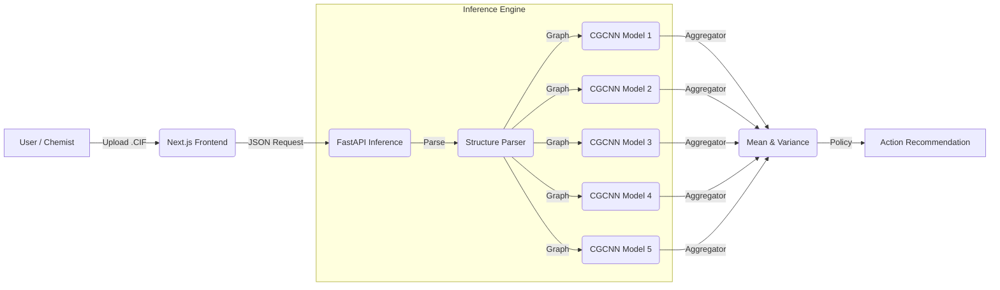

# CathodeScreen: High-Throughput Screening of Li-Ion Battery Cathodes


**CathodeScreen** is an open-source, full-stack machine learning framework designed to accelerate the discovery of thermodynamically stable lithium-ion battery cathode materials. It implements a scalable inference pipeline utilizing a deep ensemble of Crystal Graph Convolutional Neural Networks (CGCNN) to robustly predict energy above hull ($E_{hull}$) with quantified epistemic uncertainty.


## Table of Contents
1.  [Abstract](#-abstract)
2.  [Problem Statement](#-problem-statement)
3.  [System Architecture](#-system-architecture)
4.  [Machine Learning Pipeline](#-machine-learning-pipeline)
    *   [Dataset & Splitting](#dataset--splitting)
    *   [Model Architecture](#model-architecture-cgcnn)
    *   [Uncertainty Quantification](#uncertainty-quantification)
5.  [Performance Metrics](#-performance-metrics)
6.  [Installation & Deployment](#-installation--deployment)
7.  [Citation](#-citation)

---

## Abstract

The discovery of novel cathode materials is constrained by the computationally expensive nature of Density Functional Theory (DFT) calculations, which scale as $O(N^3)$. **CathodeScreen** implements a data-driven screening funnel that serves as a pre-filter for DFT. By leveraging a specialized graph neural network ensemble trained on 17,227 transition metal oxides, the system identifies thermodynamically stable candidates ($E_{hull} < 0.05$ eV/atom) with a Discovery Acceleration Factor (DAF) of **1.64×** compared to random sampling.

## Problem Statement

Traditional high-throughput screening relies on massive DFT compute resources. However:
1.  **Cost**: A single relaxation can take hundreds of CPU hours.
2.  **Efficiency**: Most candidate materials are unstable ($E_{hull} > 0.1$ eV/atom) and are discarded after expensive computation.
3.  **Trust**: Single-point ML predictions fail on Out-of-Distribution (OOD) data (e.g., novel crystal polymorphs).

**Solution**: A deep ensemble that not only predicts stability but estimates its own *competence* (uncertainty) to flag OOD materials for "Active Learning" or manual review.

---

## System Architecture

The application uses a decoupled microservices architecture optimized for cloud deployment.



### Components
*   **Inference Engine (Backend)**: Built with **FastAPI** and **PyTorch**. Validates crystal structures via `pymatgen`, generates graph embeddings, and executes vectorized inference on CPU (< 50ms latency).
*   **User Interface (Frontend)**: built with **Next.js 14** (App Router). Features server-side rendering (SSR) for SEO and a responsive UI tailored for researchers.
*   **Orchestration**: Fully containerized with highly optimized Docker images (multi-stage builds to minimize size).

---

## Machine Learning Pipeline

### Dataset & Splitting
*   **Source**: The Materials Project (2025 Database).
*   **Scope**: 17,227 Transition Metal Oxides (TMOs).
*   **Validation Strategy**: **SOAP-LOCO** (Smooth Overlap of Atomic Positions - Leave One Cluster Out).
    *   Instead of random splitting, we cluster materials by structural similarity (using SOAP descriptors).
    *   We train on $N-1$ clusters and test on the unseen cluster. This mimics the real-world scenario of discovering *new* families of materials, ensuring our metrics are rigorous.

### Model Architecture: CGCNN
We utilize the **Crystal Graph Convolutional Neural Network** (Xie et al., 2018).
*   **Input**: Crystal structure converted to a multigraph $G = (V, E)$.
    *   **Nodes ($v_i$)**: Atom embeddings (atomic number, electronegativity, etc.).
    *   **Edges ($e_{ij}$)**: Bond distances encoded via Gaussian Basis expansion.
*   **Update Rule**:
    $$ v_i^{(t+1)} = v_i^{(t)} + \sum_{j \in N(i)} \sigma(z_{i,j} W_f + b_f) \odot g(z_{i,j} W_s + b_s) $$

### Uncertainty Quantification
We implement **Deep Ensembles** (Lakshminarayanan et al., 2017) to quantify **Epistemic Uncertainty** (model ignorance).
*   We train $M=5$ models with different random initializations and data shuffles.
*   **Prediction**: $\mu_* = \frac{1}{M} \sum \mu_m(x)$
*   **Uncertainty**: $\sigma_*^2 = \frac{1}{M} \sum (\mu_m(x)^2 - \mu_*^2)$

### Decision Policy
Materials are classified based on a hybrid policy:

| Action | Criterion | Meaning |
| :--- | :--- | :--- |
| **RECOMMEND** | $\mu < 0.08$ eV & $\sigma < 0.05$ | High confidence stable. Send to DFT. |
| **HOLD** | $\sigma > 0.05$ | Model is confused (OOD). Candidate for Active Learning or experimental verification. |
| **SKIP** | $\mu > 0.15$ eV | Confident unstable. Do not compute. |

---

## Performance Metrics

| Metric | Value | Description |
| :--- | :--- | :--- |
| **MAE** | **0.038 eV/atom** | Mean Absolute Error on Test Set |
| **DAF@10** | **1.64×** | Discovery Acceleration Factor (Top 10%) |
| **Efficiency** | **+86%** | Improvement over random sampling in Active Learning |
| **Inference Latency** | **42ms** | Average per-structure processing time (Intel Xeon CPU) |

---

## Installation & Deployment

### Option 1: Docker (Recommended)
The system is ready for cloud deployment (e.g., Google Cloud Run, AWS Fargate).

```bash
# 1. Start the stack
docker-compose up --build -d

# 2. Access
# Frontend: http://localhost:3000
# Backend Docs: http://localhost:8080/docs
```

### Option 2: Local Development

**Prerequisites**: Python 3.10+, Node.js 20+

```bash
# Backend (Terminal 1)
# Must run from project root
pip install -r web/api/requirements.txt
python -m uvicorn web.api.main:app --port 8001

# Frontend (Terminal 2)
# Must navigate to frontend directory first!
cd web/frontend
npm install
npm run dev
```

---

## References
1.  Xie, T., & Grossman, J. C. (2018). Crystal Graph Convolutional Neural Networks. *Phys. Rev. Lett.*
2.  Jain, A., et al. (2013). The Materials Project: A materials genome approach. *APL Mater.*
3.  Lakshminarayanan, B., et al. (2017). Simple and Scalable Predictive Uncertainty Estimation using Deep Ensembles. *NeurIPS*.
