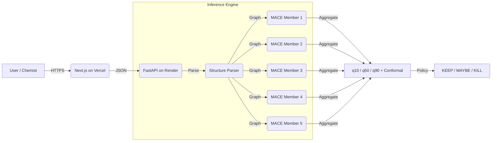

# CathodeScreen: High-Throughput Screening of Li-Ion Battery Cathodes


**CathodeScreen** is a machine learning framework designed to accelerate the discovery of thermodynamically stable lithium-ion battery cathode materials. It implements a scalable inference pipeline utilizing a deep ensemble of **MACE-MP-0** fine-tuned models (with CHGNet and CGCNN fallbacks) to robustly predict energy above hull ($E_{hull}$) with quantified epistemic and aleatoric uncertainty, conformal calibration, and automated governance.


## Table of Contents
1.  [Abstract](#abstract)
2.  [Problem Statement](#problem-statement)
3.  [System Architecture](#system-architecture)
4.  [Machine Learning Pipeline](#machine-learning-pipeline)
5.  [Performance Metrics](#performance-metrics)
6.  [Installation & Deployment](#installation--deployment)
7.  [References](#references)

---

## Abstract

The discovery of novel cathode materials is constrained by the computationally expensive nature of Density Functional Theory (DFT) calculations, which scale as $O(N^3)$. **CathodeScreen** implements a data-driven screening funnel that serves as a pre-filter for DFT. The primary model is a **5-member MACE-MP-0 fine-tuned ensemble** with conformal calibration, achieving **Test MAE: 0.030 eV**, **Spearman: 0.663**, **90% prediction interval coverage**, and **92.7% KEEP precision** with **0% false-kill rate**. The system passes all 6 automated governance checks (ranking, calibration, precision, false-kill, decision-making).

## Problem Statement

Traditional high-throughput screening relies on massive DFT compute resources. However:
1.  **Cost**: A single relaxation can take hundreds of CPU hours.
2.  **Efficiency**: Most candidate materials are unstable ($E_{hull} > 0.1$ eV/atom) and are discarded after expensive computation.
3.  **Trust**: Single-point ML predictions fail on Out-of-Distribution (OOD) data (e.g., novel crystal polymorphs).

**Solution**: A deep ensemble that not only predicts stability but estimates its own *competence* (uncertainty) to flag OOD materials for "Active Learning" or manual review.

---

## System Architecture

The application uses a decoupled architecture deployed to **Render** (backend) and **Vercel** (frontend).



### Components
*   **Inference Engine (Backend)**: Built with **FastAPI** and **PyTorch**. Validates crystal structures via `pymatgen`, computes neighbor lists, and runs the 5-member MACE ensemble with conformal calibration. Deployed on **Render** as a Docker web service.
*   **User Interface (Frontend)**: Built with **Next.js 14** (App Router). Deployed on **Vercel** with automatic preview deployments on PRs.
*   **Model Adapters**: Pluggable model backend via `CATHODE_MODEL_TYPE` env var — supports `mace` (production), `chgnet`, and `cgcnn` (legacy).

---

## Machine Learning Pipeline

### Dataset & Splitting
*   **Source**: The Materials Project (2025 Database).
*   **Scope**: 17,227 Transition Metal Oxides (TMOs).
*   **Validation Strategy**: **SOAP-LOCO** (Smooth Overlap of Atomic Positions - Leave One Cluster Out).
    *   Instead of random splitting, we cluster materials by structural similarity (using SOAP descriptors).
    *   We train on $N-1$ clusters and test on the unseen cluster. This mimics the real-world scenario of discovering *new* families of materials, ensuring our metrics are rigorous.

### Model Architecture: MACE-MP-0 Fine-tuned Ensemble
The production model is a **5-member MACE-MP-0** (Batatia et al., 2023) fine-tuned ensemble:
*   **Base Model**: MACE-MP-0 "medium" backbone (~3.5M params), pre-trained on the Materials Project
*   **Fine-tuning**: Backbone frozen except last interaction block; custom regression head (128-dim) with quantile outputs (q10, q50, q90) and stability classification (p_stable, p_metastable)
*   **Ensemble**: 5 members with seeds 42-46, early stopping on val MAE
*   **Calibration**: Post-hoc symmetric conformal calibration on validation set for 90% coverage
*   **Artifacts**: `artifacts/models/mace_ensemble_v1/` (~106 MB total)

### Uncertainty Quantification
*   **Aleatoric**: Per-model quantile regression (q10, q90) captures data noise
*   **Epistemic**: Inter-model disagreement (std of q50 across 5 members) captures model ignorance
*   **Conformal**: Symmetric delta added to intervals to guarantee 90% coverage on calibration set
*   **Total**: σ_total = √(σ_aleatoric² + σ_epistemic²)

### Decision Policy
Materials are classified using conformally-calibrated quantile predictions:

| Action | Criterion | Meaning |
| :--- | :--- | :--- |
| **KEEP** | q90 < 0.05 eV & p_stable > 0.8 | High confidence stable. Send to DFT. |
| **KEEP** | q90 < 0.10 eV & p_stable > 0.7 | Likely metastable. Worth DFT. |
| **KILL** | q10 > 0.10 eV | Confident unstable. Do not compute. |
| **MAYBE** | Otherwise | Uncertain. Manual review recommended. |

---

## Performance Metrics (MACE Ensemble v1)

### Governance Report (APPROVED)

All 6 automated governance checks passed. Full report: `data/reports/model_validation/model_validation_report.json`

| Check | Status |
| :--- | :--- |
| Ranking (val) — Spearman > 0.5 | PASS (0.754) |
| Ranking (test) — Spearman > 0.5 | PASS (0.663) |
| Calibration (test) — 90% coverage | PASS (91.3%) |
| False-kill rate < 2% | PASS (0.0%) |
| KEEP precision > 85% | PASS (92.7%) |
| System makes decisions | PASS |

### Ranking & Accuracy

| Split | N | Spearman ρ | MAE (eV) | EF@10 | Frac Stable @100 |
| :--- | :--- | :--- | :--- | :--- | :--- |
| **Val** | 1,842 | 0.754 | 0.033 | 2.26x | 91% |
| **Test** | 1,013 | 0.663 | 0.030 | 2.12x | 94% |
| **LOCO** | 764 | -0.024 | 0.104 | 1.77x | 66% |

### Calibration

| Split | Coverage (target 90%) | Median Interval Width | Met? |
| :--- | :--- | :--- | :--- |
| **Val** | 90.1% | 0.106 eV | Yes |
| **Test** | 91.3% | 0.109 eV | Yes |
| **LOCO** | 72.0% | 0.175 eV | No |

### Decision Outcomes (Test Set)

| Metric | Value |
| :--- | :--- |
| KEEP precision | 92.7% |
| KEEP recall | 23.8% |
| KILL precision | 73.3% |
| False-kill rate | 0.0% |
| Materials KEEP'd | 123 / 1,013 (12.1%) |
| Materials KILL'd | 15 / 1,013 (1.5%) |

**Known limitation**: LOCO (leave-one-cluster-out) performance degrades significantly — Spearman near zero, coverage 72%. The model is reliable for in-distribution cathodes but should not be trusted for structurally novel polymorphs without additional validation.

### Legacy CHGNet Metrics

> Prior CHGNet v2-merged results: EF@1% = **26.29x**, OQMD EF@1% = **1.36x**, JARVIS EF@1% = **1.86x**. See `reports/` for full grounded-win analysis.

---

## Training

### MACE Ensemble (Production)

Trained locally with `scripts/04_train_ensemble.py` using config `configs/train_mace_ehull.yaml`:

| Member | Seed | Val MAE | Test MAE | Spearman | Epochs |
| :--- | :--- | :--- | :--- | :--- | :--- |
| 0 | 42 | 0.036 | 0.032 | 0.651 | ~40 |
| 1 | 43 | 0.032 | 0.033 | 0.655 | ~35 |
| 2 | 44 | 0.035 | 0.029 | 0.664 | ~38 |
| 3 | 45 | 0.031 | 0.028 | 0.672 | ~42 |
| 4 | 46 | 0.034 | 0.031 | 0.638 | ~36 |
| **Mean** | | **0.034** | **0.031** | **0.656** | |

Post-training steps:
1. `scripts/07_predict_ensemble.py` — generate val/test/LOCO predictions
2. `scripts/05b_conformal_calibrate.py` — compute conformal delta for 90% coverage
3. `scripts/validate_model_trust.py` — run governance checks (must pass 6/6)

### Legacy CHGNet Runs (H100 / Vertex AI)

Prior CHGNet training on H100 GPUs via Vertex AI custom jobs. See `gcp/` for job configs and `reports/` for grounded-win results.

---

## Installation & Deployment

### Production: Render (Backend) + Vercel (Frontend)

**Backend (Render)**:
1. Create a new Web Service on [Render](https://render.com) from this repo
2. Set **Root Directory** to `.` and **Dockerfile Path** to `render.Dockerfile`
3. Configure environment variables:

| Variable | Value | Required |
| :--- | :--- | :--- |
| `CATHODE_MODEL_TYPE` | `mace` | Yes |
| `CATHODE_DEVICE` | `cpu` | Yes |
| `CATHODE_CORS_ORIGINS` | `https://your-app.vercel.app` | Yes |
| `CATHODE_AUTH_ENABLED` | `true` | Recommended |
| `CATHODE_API_KEY` | (your key) | If auth enabled |

Or use the Render Blueprint: `render.yaml` auto-configures the service.

**Frontend (Vercel)**:
1. Import `web/frontend` on [Vercel](https://vercel.com)
2. Set environment variables:

| Variable | Value |
| :--- | :--- |
| `NEXT_PUBLIC_API_URL` | `https://your-backend.onrender.com` |
| `NEXT_PUBLIC_API_KEY` | (if auth enabled) |

### Option 2: Docker Compose (Local)

```bash
docker-compose up --build -d
# Frontend: http://localhost:3000
# Backend Docs: http://localhost:8080/docs
```

### Option 3: Local Development

**Prerequisites**: Python 3.10+, Node.js 20+

```bash
# Backend (Terminal 1)
pip install -r web/api/requirements.txt
CATHODE_MODEL_TYPE=mace python -m uvicorn web.api.main:app --port 8000

# Frontend (Terminal 2)
cd web/frontend
npm install
npm run dev
```

### API Security & Limits

For production deployments:
- Set `CATHODE_ENV=production`, `CATHODE_AUTH_ENABLED=true`, and provide `CATHODE_API_KEY` (or `CATHODE_API_KEYS` / `CATHODE_API_KEY_HASHES`). Requests can use `X-API-Key` or `Authorization: Bearer`.
- Configure request limits and validation, e.g. `CATHODE_RATE_LIMIT_PER_MINUTE`, `CATHODE_MAX_FILE_BYTES`, `CATHODE_MAX_BATCH_SIZE`, and `CATHODE_MAX_ATOMS`.
- Apply backpressure with `CATHODE_MAX_CONCURRENT_REQUESTS` and `CATHODE_CONCURRENCY_TIMEOUT_SECONDS`.
- Consider `CATHODE_IP_ALLOWLIST`, `CATHODE_TRUST_PROXY`, `CATHODE_FORCE_HTTPS`, and `CATHODE_SECURITY_HEADERS` behind a trusted reverse proxy.
- Use `CATHODE_SECRET_FILE` or `CATHODE_SECRET_COMMAND` to load secrets at startup.
- Enforce startup checks with `CATHODE_STRICT_STARTUP=true` and `CATHODE_REQUIRE_CALIBRATION=true`.
- Sign and verify artifacts with `CATHODE_MANIFEST_HMAC_KEY` + `CATHODE_REQUIRE_MANIFEST_SIGNATURE=true`.
- Keep safe checkpoint loading enabled; only set `CATHODE_ALLOW_UNSAFE_TORCH_LOAD=true` when artifacts are fully trusted.

### Observability

- Each response includes `X-Request-ID` (client-supplied or generated).
- Enable request logging with `CATHODE_LOG_REQUESTS=true`.
- Enable Prometheus text metrics at `/metrics/prometheus` with `CATHODE_PROMETHEUS_ENABLED=true`.
- Enable OpenTelemetry tracing with `CATHODE_OTEL_ENABLED=true` and set `CATHODE_OTEL_EXPORTER_OTLP_ENDPOINT`.
- See `docs/observability.md` for example alert rules.
- GCP-specific alert setup is covered in `docs/gcp_observability.md`.

### ML Governance

- Generate and sign artifact manifests with `scripts/08_generate_artifact_manifest.py --sign` and verify via `CATHODE_REQUIRE_MANIFEST_SIGNATURE=true`.
- Evaluate prediction quality with `scripts/09_evaluate_predictions.py`.
- Track drift with `scripts/10_compute_drift.py` (outputs `retrain_recommended` when PSI exceeds threshold).
- Gate releases with `scripts/12_validate_release.py` and publish to a registry using `scripts/13_publish_registry.py`.

### Load Testing

- Use `scripts/11_load_test_api.py` to generate baseline latency/error stats for `/predict`.
- For Cloud Run scaling guidance, see `docs/gcp_scaling.md`.

### DFT Spot Check (Quantum Espresso)

A small DFT audit batch is generated under `reports/dft_qe_jarvis_50_mix` to validate screening results with QE relaxations.

```bash
cd reports/dft_qe_jarvis_50_mix
python3 check_pseudos.py

# Sequential
PW_CMD=pw.x bash run_all_qe.sh

# Parallel on a single VM
JOBS=4 MPI_PROCS=2 PW_CMD=pw.x bash run_all_qe_parallel.sh

# Slurm
sbatch submit_slurm_array.sh
```

Pseudopotentials (SSSP 1.3.0 PBE precision) live in `reports/dft_qe_jarvis_50_mix/pseudos`, and the max cutoffs are recorded in `reports/dft_qe_jarvis_50_mix/settings.json`.
Large QE outputs are ignored in `.gitignore` so only inputs and metadata stay in version control.

---

## References
1.  Batatia, I., et al. (2023). MACE-MP-0: A Foundation Model for Materials Science. *arXiv:2401.00096*.
2.  Deng, B., et al. (2023). CHGNet: Pretrained universal neural network potential for charge-informed atomistic modelling. *Nature Machine Intelligence*.
3.  Jain, A., et al. (2013). The Materials Project: A materials genome approach. *APL Mater.*
4.  Lakshminarayanan, B., et al. (2017). Simple and Scalable Predictive Uncertainty Estimation using Deep Ensembles. *NeurIPS*.
5.  Bartók, A. P., et al. (2013). On representing chemical environments. *Phys. Rev. B*.
6.  Vovk, V., et al. (2005). Algorithmic Learning in a Random World. *Springer*. (Conformal prediction)
